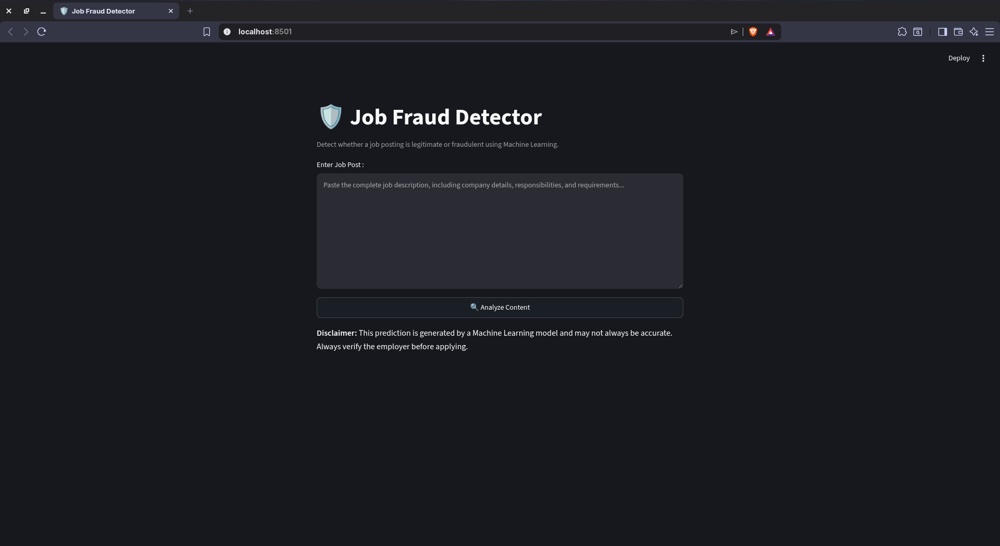
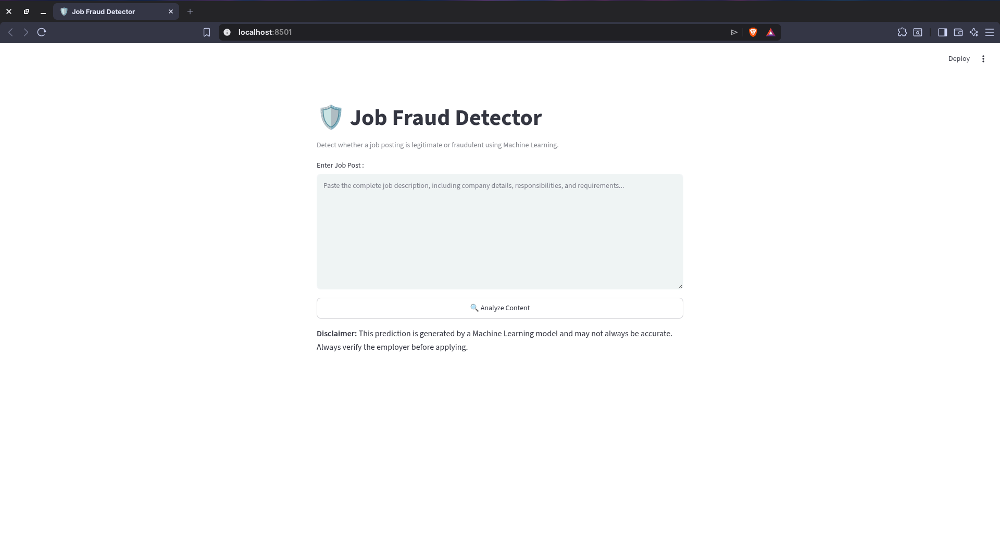
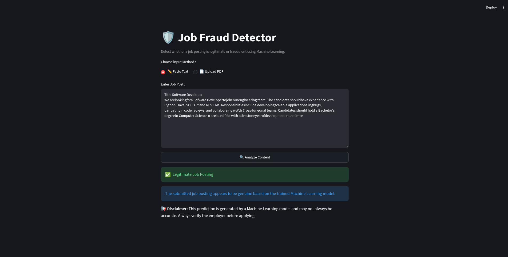
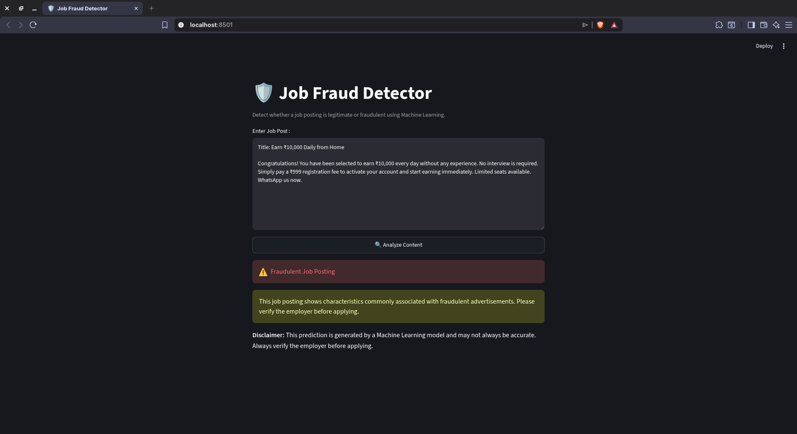

# 🕵️ Fake Job Posting Detection using Machine Learning & NLP

A Machine Learning and Natural Language Processing (NLP) project that detects whether a job posting is **Legitimate (Real)** or **Fraudulent (Fake)** using **TF-IDF Vectorization** and multiple classification algorithms.

---

## 📑 Table of Contents

* [📌 Project Overview](#-project-overview)
* [✨ Features](#-features)
* [📂 Dataset](#-dataset)
* [🛠️ Technologies Used](#️-technologies-used)
* [🚀 Installation](#-installation)
* [🌐 Streamlit Web Application](#-streamlit-web-application)
* [🖼️ Application Screenshots](#️-application-screenshots)
* [🔄 Workflow](#-workflow)
* [🤖 Machine Learning Models](#-machine-learning-models)
* [📈 Evaluation Metrics](#-evaluation-metrics)
* [📁 Project Structure](#-project-structure)
* [✅ Results](#-results)
* [🚀 Future Improvements](#-future-improvements)
* [⚠️ Limitations](#️-limitations)
* [📄 License](#-license)
* [👨‍💻 Author](#-author)

---

## 📌 Project Overview

Online job portals contain both genuine and fraudulent job postings. This project applies Natural Language Processing (NLP) and Machine Learning techniques to automatically classify job postings as **Legitimate** or **Fraudulent**.

The project includes data preprocessing, feature engineering, TF-IDF vectorization, model comparison, hyperparameter tuning, model serialization, and a Streamlit-based prediction system for unseen job postings.

---

## ✨ Features

* Exploratory Data Analysis (EDA)
* Missing Value Handling
* Text Preprocessing
* TF-IDF Vectorization
* Multiple Machine Learning Models
* Hyperparameter Tuning
* Confusion Matrix
* Model Serialization using Pickle
* Streamlit Web Application
* Real-time Prediction System

---

## 📂 Dataset

**Dataset:** Fake Job Postings Dataset

### Target Variable

| Value | Meaning        |
| ----- | -------------- |
| 0     | Legitimate Job |
| 1     | Fraudulent Job |

### Main Features

* Title
* Company Profile
* Description
* Requirements
* Benefits

---

## 🛠️ Technologies Used

* Python
* Pandas
* Matplotlib
* Scikit-learn
* Streamlit
* Pickle
* Pdfplumber

---

## 🚀 Installation

### Clone the Repository

```bash
git clone https://github.com/Sushantkr99/Fake_Job_Posting_Detection.git
cd Fake_Job_Posting_Detection
```

---

## Option 1: Google Colab (Recommended for Beginners)

1. Open **Google Colab**.
2. Upload `fake_job_prediction_by_ml_model.ipynb`.
3. Upload `fake_job_postings.csv` to the **Files** panel.
4. If `pd.read_csv("fake_job_postings.csv")` doesn't work, right-click the uploaded CSV in the **Files** panel, select **Copy path**, and use that path in `pd.read_csv()`. For example:

```python
df = pd.read_csv("/content/fake_job_postings.csv")
```

5. Install the required packages (if needed):

```bash
!pip install pandas matplotlib scikit-learn
```

6. Run all notebook cells from top to bottom.

---

## Option 2: Conda + VS Code + Jupyter Notebook

### Step 1: Create Environment

```bash
conda create -n ai python=3.12 -y
```

### Step 2: Activate Environment

```bash
conda activate ai
```

### Step 3: Install Required Packages

Install all required dependencies using the provided `requirements.txt` file.

```bash
pip install -r requirements.txt
```

### Step 4: Register Jupyter Kernel

```bash
python -m ipykernel install --user --name ai --display-name "Python (ai)"
```

### Step 5: Open Project

```bash
code .
```

### Step 6

Open:

```text
fake_job_prediction_by_ml_model.ipynb
```

### Step 7

Select the **Python (ai)** kernel.

### Step 8

Run all notebook cells.

---

## Option 3: Python venv + VS Code + Jupyter Notebook

### Step 1

```bash
python -m venv .venv
```

### Step 2

Windows

```bash
.venv\Scripts\activate
```

Linux/macOS

```bash
source .venv/bin/activate
```

### Step 3: Install Required Packages

Install all required dependencies using the provided `requirements.txt` file.

```bash
pip install -r requirements.txt
```

### Step 4

```bash
python -m ipykernel install --user --name .venv --display-name "Python (.venv)"
```

### Step 5

```bash
code .
```

### Step 6

Open:

```text
fake_job_prediction_by_ml_model.ipynb
```

### Step 7

Select the **Python (.venv)** kernel.

### Step 8

Run all notebook cells.

---

## 🌐 Streamlit Web Application

A simple and interactive **Streamlit** web application was developed to demonstrate the trained Machine Learning model.

### Features

* Paste any job posting into the text area.
* Predict whether the job posting is **Legitimate** or **Fraudulent**.
* Real-time prediction using the trained **Linear SVM** model.
* Clean and responsive user interface.
* Input validation for empty and very short job descriptions.

### Required Files

```text
app.py
model.pkl
tfidf.pkl
```

### Install Streamlit

```bash
pip install streamlit
```

### Run the Application

```bash
streamlit run app.py
```

After running the command, Streamlit will automatically open the application in your default web browser.

If it does not open automatically, visit:

```text
http://localhost:8501
```

---

## 🖼️ Application Screenshots

### Home Page

<table align="center">
<tr>
<td align="center">
<b>Dark Mode</b><br><br>

</td>

<td width="40"></td>

<td align="center">
<b>Light Mode</b><br><br>

</td>
</tr>
</table>

---

### Legitimate Job Prediction

<p align="center">
  
</p>

---

### Fraudulent Job Prediction

<p align="center">
  
</p>

---

## 🔄 Workflow

```text
Dataset
      │
      ▼
EDA
      │
      ▼
Data Cleaning
      │
      ▼
Text Preprocessing
      │
      ▼
TF-IDF Vectorization
      │
      ▼
Train-Test Split
      │
      ▼
Model Training
      │
      ▼
Model Comparison
      │
      ▼
Hyperparameter Tuning
      │
      ▼
Best Model Selection
      │
      ▼
Save Model (Pickle)
      │
      ▼
Streamlit Web Application
      │
      ▼
Prediction System
```

---

## 🤖 Machine Learning Models

* Logistic Regression
* Multinomial Naive Bayes
* Linear Support Vector Machine (Linear SVM)
* K-Nearest Neighbors (KNN)
* Random Forest Classifier
* Passive Aggressive Classifier

---

## 📈 Evaluation Metrics

* Accuracy
* Precision
* Recall
* F1 Score
* Confusion Matrix

---

## 📁 Project Structure

```text
Fake_Job_Posting_Detection/
│
├── images/
│   ├── homepage_dark_mode.png
│   ├── homepage_light_mode.png
│   ├── legitimate.png
│   └── fraudulent.png
│
├── app.py
├── model.pkl
├── tfidf.pkl
├── fake_job_prediction_by_ml_model.ipynb
├── fake_job_postings.csv
├── README.md
└── requirements.txt
```

---

## ✅ Results

### Best Performing Model

| Model                                          | Selection Criteria |
| ---------------------------------------------- | ------------------ |
| **Linear Support Vector Machine (Linear SVM)** | Highest F1 Score   |

The **Linear SVM** achieved the highest F1 Score among all evaluated models and was selected as the final model.

The trained model was deployed using **Streamlit**, enabling users to classify unseen job postings as **Legitimate** or **Fraudulent** through an interactive web interface.

---

## 🚀 Future Improvements

The following enhancements are planned for future releases:

* Display prediction confidence scores.
* Deploy the Streamlit application online.
* Experiment with transformer-based NLP models such as BERT.
* Improve the user interface and overall user experience.

---

## ⚠️ Limitations

* Relies primarily on textual information.
* Performance depends on the quality of the dataset.
* Fraud patterns may change over time.
* Intended as a decision-support tool rather than a final decision-maker.

---

## 📄 License

This project is intended for educational and learning purposes.

---

## 👨‍💻 Author

**Sushant Kumar**

B.Tech Computer Science & Engineering

GitHub: **https://github.com/Sushantkr99**
